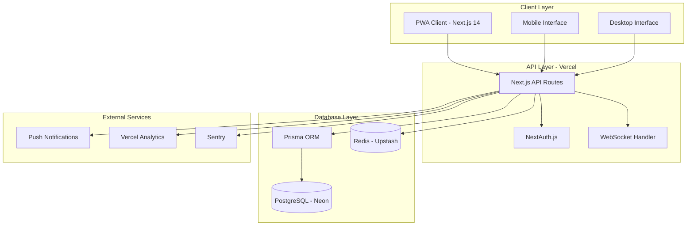
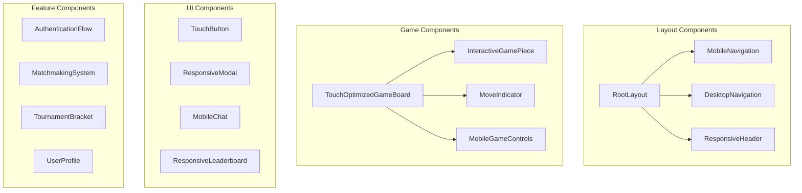

# Design Document

## Overview

The Advanced Viking Chess application will be built as a modern, mobile-first Progressive Web App using Next.js 14+ with App Router, deployed on Vercel's serverless platform. The architecture emphasizes performance, scalability, and user experience across all devices, with particular attention to mobile optimization.

## Architecture

### High-Level Architecture



### Technology Stack

**Frontend:**
- Next.js 14+ with App Router and React Server Components
- TypeScript with strict mode
- Tailwind CSS with mobile-first responsive design
- Framer Motion for animations
- React Hook Form with Zod validation
- TanStack Query for state management
- PWA capabilities with next-pwa

**Backend:**
- Next.js API Routes (serverless functions)
- NextAuth.js for authentication
- Prisma ORM with PostgreSQL
- WebSocket support via custom implementation
- Redis for session storage and real-time features

**Database:**
- PostgreSQL (Neon for serverless compatibility)
- Redis (Upstash for serverless caching)

**Deployment & Infrastructure:**
- Vercel for hosting and serverless functions
- Vercel Analytics for performance monitoring
- Sentry for error tracking
- Upstash Redis for caching and sessions

## Components and Interfaces

### Core Components Architecture



### Mobile-First Component Design

**TouchOptimizedGameBoard:**
- Minimum 44px touch targets for all interactive elements
- Gesture support (tap, drag, pinch-to-zoom)
- Haptic feedback integration
- Responsive grid system that adapts to screen size
- Visual feedback for valid/invalid moves

**MobileGameControls:**
- Bottom sheet design for easy thumb access
- Swipe gestures for common actions
- Voice commands integration
- Quick action buttons with clear visual hierarchy

**ResponsiveModal:**
- Full-screen on mobile, centered on desktop
- Smooth animations with reduced motion support
- Keyboard and screen reader accessible
- Touch-friendly close mechanisms

### API Interface Design

**Authentication Endpoints:**
```typescript
// /api/auth/[...nextauth].ts - NextAuth.js configuration
// /api/auth/register - User registration
// /api/auth/verify - Email verification
// /api/auth/reset-password - Password reset
```

**Game Management:**
```typescript
// /api/games - CRUD operations for games
// /api/games/[id]/moves - Move validation and execution
// /api/games/[id]/chat - Real-time chat messages
// /api/games/[id]/spectate - Spectator functionality
```

**Real-time Communication:**
```typescript
// /api/socket - WebSocket connection handler
// Real-time events: game_update, chat_message, player_joined, move_made
```

**Matchmaking & Tournaments:**
```typescript
// /api/matchmaking - Skill-based matchmaking
// /api/tournaments - Tournament management
// /api/leaderboard - Rankings and statistics
```

## Data Models

### Enhanced Database Schema

```prisma
model User {
  id              String    @id @default(cuid())
  email           String    @unique
  username        String    @unique
  displayName     String
  avatar          String?
  emailVerified   DateTime?
  password        String
  
  // Game Statistics
  rating          Int       @default(1200)
  peakRating      Int       @default(1200)
  wins            Int       @default(0)
  losses          Int       @default(0)
  draws           Int       @default(0)
  winStreak       Int       @default(0)
  longestStreak   Int       @default(0)
  
  // Preferences
  preferredRole   Role      @default(DEFENDER)
  theme           String    @default("dark")
  language        String    @default("en")
  notifications   Boolean   @default(true)
  
  // Social Features
  friends         Friendship[] @relation("UserFriends")
  friendOf        Friendship[] @relation("FriendOfUser")
  achievements    UserAchievement[]
  
  // Game Relations
  hostedGames     Game[]    @relation("GameHost")
  guestGames      Game[]    @relation("GameGuest")
  chatMessages    ChatMessage[]
  
  createdAt       DateTime  @default(now())
  updatedAt       DateTime  @updatedAt
  lastSeen        DateTime  @default(now())
}

model Game {
  id              String    @id @default(cuid())
  
  // Players
  host            User      @relation("GameHost", fields: [hostId], references: [id])
  hostId          String
  guest           User?     @relation("GameGuest", fields: [guestId], references: [id])
  guestId         String?
  
  // Game State
  status          GameStatus @default(WAITING)
  boardState      Json
  moveHistory     Json      @default("[]")
  currentPlayer   Role      @default(ATTACKER)
  
  // Game Configuration
  hostRole        Role      @default(DEFENDER)
  timeControl     String    @default("15+10")
  isRanked        Boolean   @default(true)
  isPrivate       Boolean   @default(false)
  
  // Game Results
  winner          Role?
  winCondition    WinCondition?
  winnerId        String?
  
  // Tournament Integration
  tournament      Tournament? @relation(fields: [tournamentId], references: [id])
  tournamentId    String?
  
  // Real-time Features
  spectators      GameSpectator[]
  chatMessages    ChatMessage[]
  
  createdAt       DateTime  @default(now())
  updatedAt       DateTime  @updatedAt
  completedAt     DateTime?
}

model Tournament {
  id              String    @id @default(cuid())
  name            String
  description     String?
  format          TournamentFormat
  status          TournamentStatus @default(REGISTRATION)
  
  // Configuration
  maxParticipants Int
  entryFee        Int       @default(0)
  prizePool       Int       @default(0)
  timeControl     String    @default("15+10")
  
  // Participants
  participants    TournamentParticipant[]
  games           Game[]
  
  // Schedule
  registrationEnd DateTime
  startDate       DateTime
  endDate         DateTime?
  
  createdAt       DateTime  @default(now())
  updatedAt       DateTime  @updatedAt
}

model AIOpponent {
  id              String    @id @default(cuid())
  name            String
  difficulty      Int       // 1-10 scale
  rating          Int
  personality     String    // Aggressive, Defensive, Balanced
  avatar          String?
  
  // AI Configuration
  thinkingTime    Int       @default(2000) // milliseconds
  strategy        Json      // AI strategy parameters
  
  games           AIGame[]
  
  createdAt       DateTime  @default(now())
  updatedAt       DateTime  @updatedAt
}

enum Role {
  ATTACKER
  DEFENDER
}

enum GameStatus {
  WAITING
  ACTIVE
  COMPLETED
  ABANDONED
}

enum WinCondition {
  KING_ESCAPE
  KING_CAPTURED
  RESIGNATION
  TIMEOUT
  DRAW
}

enum TournamentFormat {
  SINGLE_ELIMINATION
  DOUBLE_ELIMINATION
  ROUND_ROBIN
  SWISS
}

enum TournamentStatus {
  REGISTRATION
  ACTIVE
  COMPLETED
  CANCELLED
}
```

## Error Handling

### Comprehensive Error Management

**Client-Side Error Handling:**
- React Error Boundaries for component-level errors
- Global error handler for unhandled promises
- User-friendly error messages with recovery options
- Offline state management with queue synchronization

**Server-Side Error Handling:**
- Structured error responses with consistent format
- Request validation using Zod schemas
- Database transaction rollbacks on failures
- Rate limiting and abuse prevention

**Real-time Error Handling:**
- WebSocket connection recovery with exponential backoff
- Message queue for failed real-time updates
- Graceful degradation when real-time features fail

```typescript
// Error Response Format
interface APIError {
  code: string;
  message: string;
  details?: Record<string, any>;
  timestamp: string;
  requestId: string;
}

// Error Codes
enum ErrorCodes {
  VALIDATION_ERROR = 'VALIDATION_ERROR',
  AUTHENTICATION_REQUIRED = 'AUTHENTICATION_REQUIRED',
  INSUFFICIENT_PERMISSIONS = 'INSUFFICIENT_PERMISSIONS',
  RESOURCE_NOT_FOUND = 'RESOURCE_NOT_FOUND',
  GAME_INVALID_MOVE = 'GAME_INVALID_MOVE',
  RATE_LIMIT_EXCEEDED = 'RATE_LIMIT_EXCEEDED',
  SERVER_ERROR = 'SERVER_ERROR'
}
```

## Testing Strategy

### Multi-Level Testing Approach

**Unit Testing:**
- Jest for utility functions and game logic
- React Testing Library for component testing
- Prisma testing with test database
- Mock implementations for external services

**Integration Testing:**
- API route testing with supertest
- Database integration tests
- WebSocket connection testing
- Authentication flow testing

**End-to-End Testing:**
- Playwright for cross-browser testing
- Mobile device testing with device emulation
- Game flow testing from start to finish
- Performance testing under load

**Mobile-Specific Testing:**
- Touch interaction testing
- Responsive design validation
- Performance on low-end devices
- Offline functionality testing
- PWA installation and features

### Performance Testing

**Core Web Vitals Optimization:**
- Largest Contentful Paint (LCP) < 2.5s
- First Input Delay (FID) < 100ms
- Cumulative Layout Shift (CLS) < 0.1

**Mobile Performance Targets:**
- Time to Interactive < 3s on 3G networks
- Bundle size optimization with code splitting
- Image optimization with next/image
- Service worker caching strategies

## Mobile-First Design Principles

### Responsive Design Strategy

**Breakpoint System:**
```css
/* Mobile First Approach */
/* Base styles: 320px+ */
.container { padding: 1rem; }

/* Small tablets: 640px+ */
@media (min-width: 640px) {
  .container { padding: 1.5rem; }
}

/* Large tablets: 768px+ */
@media (min-width: 768px) {
  .container { padding: 2rem; }
}

/* Desktop: 1024px+ */
@media (min-width: 1024px) {
  .container { padding: 3rem; }
}
```

**Touch-Optimized Interactions:**
- Minimum 44px touch targets
- Gesture support (swipe, pinch, long press)
- Haptic feedback for game actions
- Visual feedback for all interactions

**Progressive Enhancement:**
- Core functionality works without JavaScript
- Enhanced features layer on top
- Graceful degradation for older browsers
- Offline-first approach with service workers

### Accessibility Integration

**WCAG 2.1 AA Compliance:**
- Semantic HTML structure
- ARIA labels and roles
- Keyboard navigation support
- Screen reader optimization
- Color contrast ratios > 4.5:1
- Focus management and indicators

**Internationalization (i18n):**
- next-i18next for translation management
- RTL language support
- Locale-specific formatting
- Cultural considerations for UI patterns

This design provides a solid foundation for building a modern, scalable, and mobile-first Viking Chess application that significantly improves upon the existing implementation while meeting all specified requirements.